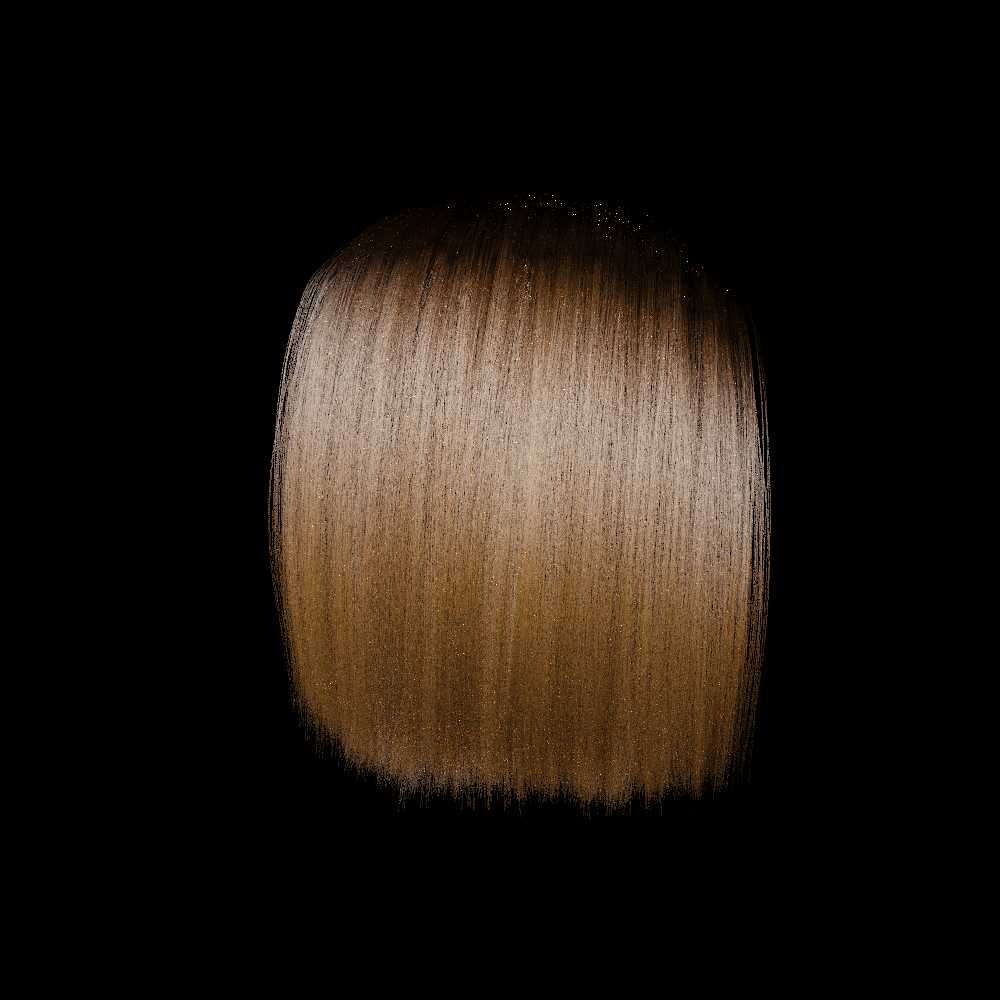
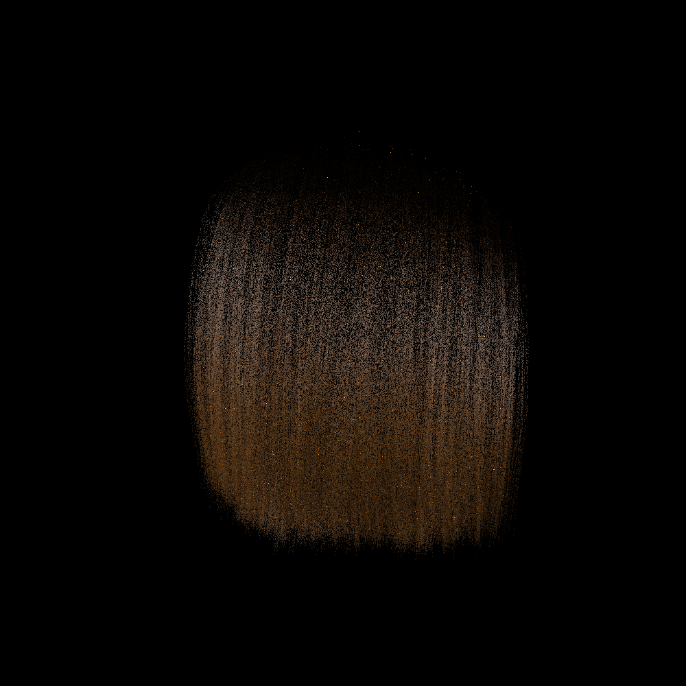

# gpis_hair

Path tracer for hair rendered as Gaussian Process Implicit Surfaces (GPIS), built on Intel Embree 4.

| Embree curves | GPIS raymarching |
|:---:|:---:|
|  |  |

All renders are available in the [`renders/`](renders/) directory.

## Dependencies

| Package | Version |
|---|---|
| [Intel Embree](https://www.embree.org/) | 4.x |
| [Intel TBB](https://www.intel.com/content/www/us/en/developer/tools/oneapi/onetbb.html) | any recent |
| CMake | ≥ 3.20 |
| Clang | C++23 |
| [spdlog](https://github.com/gabime/spdlog) | fetched automatically |

On Arch Linux:
```sh
sudo pacman -S embree tbb cmake clang
```

## Build

```sh
cmake -B build
cmake --build build
```

Hair assets (`assets/`) are stored with [Git LFS](https://git-lfs.com). Install it and run `git lfs pull` after cloning.

## Run

```sh
./render.sh [scene] [extra flags...]
```

Available scenes:

| Scene | Description |
|---|---|
| `instant` | one curl, 400×300, 1 spp |
| `test` | one curl, 400×400, 8 spp |
| `test_gpis` | one curl, GPIS mode, 8 spp |
| `dual` | curl + straight hair side by side |
| `curls` | four curls in a row |
| `hair` | straight hair alone |
| `compare` | same curl twice for BSDF comparison |
| `profile` | side-view, Embree curves |
| `profile_gpis` | side-view, GPIS raymarching |
| `curl_gpis` | single curl, GPIS mode |
| `gpis` | single curl, GPIS, 4 spp |

Or call the renderer directly:

```sh
./build/gpis_hair assets/curl.m3hair --spp 64 --width 1000 --height 1000 -o renders/out.ppm
```

```
Options:
  --width  <int>     image width
  --height <int>     image height
  --spp    <int>     samples per pixel
  --depth  <int>     max path depth
  --spacing <float>  X spacing between assets
  --rotate  IDX:DEG  Y-axis rotation for asset at index IDX
  -o <path>          output PPM
  --mode <string>    embree | raymarching
```

## References

Kehan Xu, Benedikt Bitterli, Eugene d'Eon, Wojciech Jarosz — *Practical Gaussian Process Implicit Surfaces with Sparse Convolutions*, ACM Trans. Graph. (SIGGRAPH Asia) 44(6), 2025. https://doi.org/10.1145/3763329

Dario Seyb, Eugene d'Eon, Benedikt Bitterli, Wojciech Jarosz — *From microfacets to participating media: A unified theory of light transport with stochastic geometry*, ACM Trans. Graph. (SIGGRAPH) 43(4), 2024. https://doi.org/10/gt5nh9

Eugene d'Eon, Guillaume François, Martin Hill, Joe Letteri, Jean-Marie Aubry — *An Energy-Conserving Hair Reflectance Model*, Computer Graphics Forum 30(4), 2011. https://doi.org/10.1111/j.1467-8659.2011.01976.x
